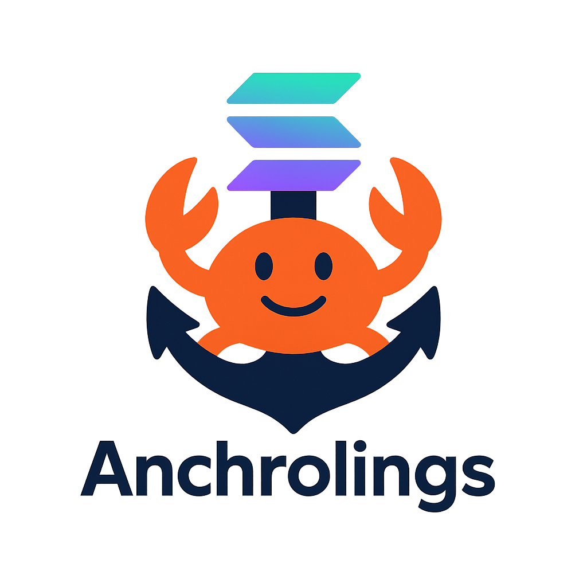

<!-- markdownlint-disable MD033 MD041 -->
<p align="center">
  
</p>

<h1 align="center">Anchorlings</h1>

<p align="center">
  <em>The Rustlings-inspired onboarding journey to Solana.</em>
</p>

---

## What is this?

Think back to your first Rustlings exercise: you fixed a tiny compile error,
hit `cargo test`, and… all green. That quick win pulled you deeper into Rust.

**Anchorlings recreates that exact moment — only now the green lights unlock
Solana.** Each exercise is a small, broken Anchor program with a `// TODO:`
comment. You edit, re-run, watch the error change shape, and move on.

30k+ developers finish Rustlings every year, but most never touch Solana —
new vocabulary (accounts, programs, CPIs), scattered resources, slow
feedback loops. Anchorlings is the missing bridge.

## Who is it for?

Rust developers (comfortable with Rustlings-level Rust) who want a tight
compile / test / fix loop into Anchor. You're assumed to know what a
keypair and a transaction are; you're **not** assumed to know what a PDA
is, or why an `Account<'info, T>` differs from an `AccountInfo<'info>`.

What this is **not**: a Solana fundamentals course, a deployment tutorial,
or a TypeScript-client tutorial. No JavaScript anywhere. No on-chain
deploy. Pure Rust, pure host-tier compile + `solana-program-test`.

## Quick start

Today Anchorlings runs from a cloned checkout (a `cargo install
anchorlings` distribution is on the roadmap):

```sh
git clone https://github.com/<owner>/anchorlings
cd anchorlings
cargo build -p anchorlings
./target/debug/anchorlings list   # see the 28 exercises
./target/debug/anchorlings run    # try the current one
```

The first `run` will fetch and compile anchor + solana — expect ~1–2
minutes once. After that, the inner loop is sub-second.

### The inner loop

```sh
anchorlings run        # runs the current exercise; fails, points at the error
# open the file in your editor, fix the TODO
anchorlings run        # passes → state advances to the next exercise
anchorlings run        # now runs the next one
```

### Commands

| Command | What it does |
| --- | --- |
| `anchorlings` / `anchorlings run` | Runs the current exercise once |
| `anchorlings run <name>` | Runs a specific exercise (e.g. `ex04_handler_arg`) |
| `anchorlings list` | Shows every exercise with done (`✓`) / current marker |
| `anchorlings hint` | Prints the hint for the current exercise |
| `anchorlings hint <name>` | Prints the hint for a specific one |
| `anchorlings reset <name>` | Marks an exercise as not-done (file restore is not yet wired up — revert the source manually) |

Progress lives in `.anchorlings-state.toml` at the workspace root. Delete
it to start over.

## Curriculum

**28 exercises across 12 chapters.** Numbers grow as the curriculum
deepens; see *Roadmap* below.

| # | Chapter | Exercises | Tier | What you learn |
| --- | --- | --- | --- | --- |
| 01 | Skeleton | 3 | check | `declare_id!`, `#[program]`, handler shape |
| 02 | Handlers | 4 | check | Instruction args, return types, custom-struct args |
| 03 | Accounts structs | 4 | check | `#[derive(Accounts)]`, the `'info` lifetime, multiple handlers |
| 04 | Constraints | 3 | mixed | `mut`, `signer`, `has_one` |
| 05 | Account types | 3 | mixed | `Account<'info, T>`, `SystemAccount`, `Program<'info, T>` |
| 06 | State | 2 | mixed | `#[account]`, multi-field state mutations |
| 07 | Init & space | 2 | check | `init` constraint, `payer`, `space`, `#[derive(InitSpace)]` |
| 08 | Errors | 2 | mixed | `#[error_code]`, `require!` |
| 09 | PDAs | 2 | mixed | `seeds`, `bump`, `find_program_address` |
| 10 | PDA signing | 1 | check | `ctx.bumps.*` for `invoke_signed` |
| 11 | CPIs | 1 | test | `CpiContext`, System Program transfer |
| 12 | Events | 1 | check | `#[event]`, `emit!` |

**Tier explained:**

- **check** — Anchorlings runs `cargo check` + `cargo clippy`. The broken
  state produces a real compile error you can read and fix.
- **test** — Anchorlings runs `cargo check` + `cargo test` + `cargo clippy`.
  The exercise ships an integration test that boots a `solana-program-test`
  bank, builds a real transaction, and asserts the lesson at runtime.

## How an exercise is laid out

```text
exercises/01_skeleton/ex01_declare_id/
├── Cargo.toml                # tiny anchor lib crate
└── src/lib.rs                # broken program with a // TODO
solutions/01_skeleton/ex01_declare_id/
├── Cargo.toml
└── src/lib.rs                # the fixed version
```

Test-tier exercises also have:

```text
tests/<name>.rs               # solana-program-test driver
```

Every exercise is a real crate — Anchor's macros need a module/crate
context, so the rustlings "single .rs file" form doesn't apply. The *tier*
is what we run on it, not what shape it is.

### The test-kit shim

`solana-program-test`'s `processor!` macro expects a fn pointer with
independent lifetimes on the `AccountInfo` slice vs. its elements, but
Anchor's generated `entry` ties them together (`&'info [AccountInfo<'info>]`).
Test-tier exercises use a one-line helper from
[`test-kit/`](test-kit/src/lib.rs):

```rust
anchorlings_test_kit::anchor_entry!(entry, my_program);

#[tokio::test]
async fn it_runs() {
    let (mut banks, payer, blockhash) =
        ProgramTest::new("my_program", my_program::ID, processor!(entry))
            .start().await;
    // ...
}
```

The unsafe lifetime-laundering lives in the kit, not in your face.

## Verifying your local build

A single script checks every solution compiles and every test-tier
solution passes its tests:

```sh
./scripts/verify-solutions.sh
```

Used in CI; useful locally before opening a PR.

## Stack & locked decisions

| Concern | Decision | Why |
| --- | --- | --- |
| Test harness | `solana-program-test` | Full tx semantics, official, pure-Rust, no validator process |
| Compile target | Native (host) only | No BPF/SBF — faster, no toolchain deps |
| Exercise language | Rust | No TypeScript anywhere |
| CLI language | Rust | Mirrors the stack |
| Prerequisites | `cargo` only | No `solana-cli`, no `anchor-cli`, no `avm`. All deps are pinned crates |
| Anchor version | `=0.30.1` | Pinned exact to prevent semver drift mid-curriculum |
| Solana version | `=1.18.26` | Mutually compatible with Anchor 0.30.1 |

## Status & roadmap

What works today:

- ✅ 28 exercises authored, all solutions compile, all test-tier solutions pass
- ✅ `anchorlings run / list / hint / reset` CLI
- ✅ `solana-program-test` ↔ Anchor lifetime bridge via `test-kit`
- ✅ Per-project state file with auto-advance on green
- ✅ Verification script

What's next (PRs welcome):

- ⏳ **Watch mode** — `notify` + 1s debounce, the headline Rustlings UX
- ⏳ **`anchorlings init`** — scaffold a workspace into an empty dir from embedded resources
- ⏳ **File restore on `reset`** — replace edited source with the original embedded bytes
- ⏳ **Fill out the curriculum** — `owner`, `address`, combinations in Ch 04; a real PDA-signed CPI in Ch 10; more state and event work; aiming for ~45 exercises total
- ⏳ **`cargo install anchorlings`** distribution once `init` lands
- ⏳ **Public leaderboard** for friendly rivalry on completion counts

## Contributing

Anchorlings is open source and built for "first time OSS" contributions.

- Adding an exercise: pick an open issue tagged `good-first-exercise`,
  copy an existing exercise + solution + info.toml entry, send a PR.
- Improving a hint: hints live in `info.toml`. One-line change, big
  pedagogical impact.
- Fixing a typo or a clippy nit: just send the PR.

Each exercise should follow the same three-part rhythm:

1. **Broken state** that produces a clean, teachable error — never a wall
   of macro vomit.
2. **Hint** that points at the lesson without giving the answer.
3. **Solution** that's the minimum change to make it pass.

Run `./scripts/verify-solutions.sh` before opening a PR.

## License

Licensed under the [Apache License, Version 2.0](LICENSE).

Copyright 2026 Nikola Todorovic, Mihajlo Pavlovic. Contributions are accepted
under the same license per Section 5 of the Apache License (no separate CLA
required).

---

<p align="center">
  <em>Anchorlings makes Solana feel as friendly as your first Rustlings commit.</em>
</p>
